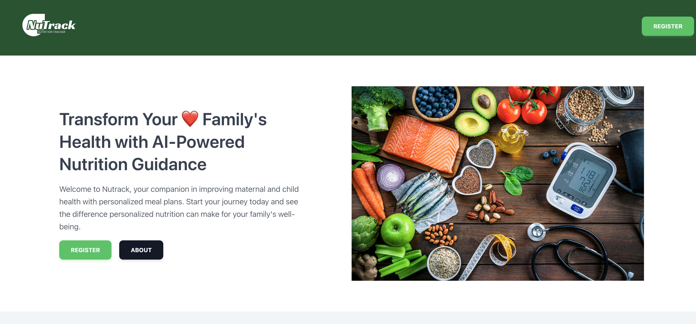
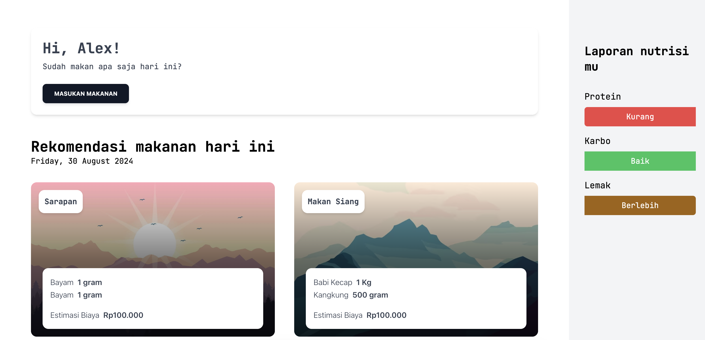

# Revolutionizing Maternal and Child Nutrition in Indonesia

**Try the application [here](https://uh6kt-zaaaa-aaaal-ajupq-cai.icp0.io/).**

## Project Overview
This project is designed to address the critical issues of maternal and child nutrition in Indonesia, particularly the problem of stunting among infants due to malnutrition. We have developed an application that leverages AI and blockchain technology to provide personalized nutritional guidance tailored to the needs and economic conditions of pregnant women and children.

### Key Features
- **Personalized Nutritional Plans:** Daily meal plans generated by AI, customized to each user's nutritional needs and economic situation.
- **Real-Time Adjustments:** The application updates meal plans daily based on user input to ensure ongoing, relevant nutritional advice.
- **Local Pricing Integration:** Ingredient prices are tailored to the Indonesian market to ensure affordability.
- **Blockchain-Powered Security:** Decentralized AI (DeAI) using the Internet Computer Protocol (ICP) for enhanced transparency and security.

## Application Screenshots
Below are some screenshots of the application showcasing its features:

### Register

*Register with personal data with mom and baby input within your planning.*

### Home Screen

*The home screen where users can see their daily nutritional summary and access meal plans.*

### Meal Input

*Input your meal daily to get more personalized meal and reporting daily.*

### Meal Logging and Report

*Screen where users can log their daily meals, allowing the AI to adjust future plans and see your nutrition reporting.*

## Getting Started
To get started with this project, clone the repository and follow the installation instructions provided in the documentation.

## Contributing
We welcome contributions from the community. Please fork the repository and submit pull requests with any enhancements or bug fixes.

## License
This project is licensed under the MIT License. See the [LICENSE](LICENSE) file for more details.

## Contact
For any questions or inquiries, please contact us.
